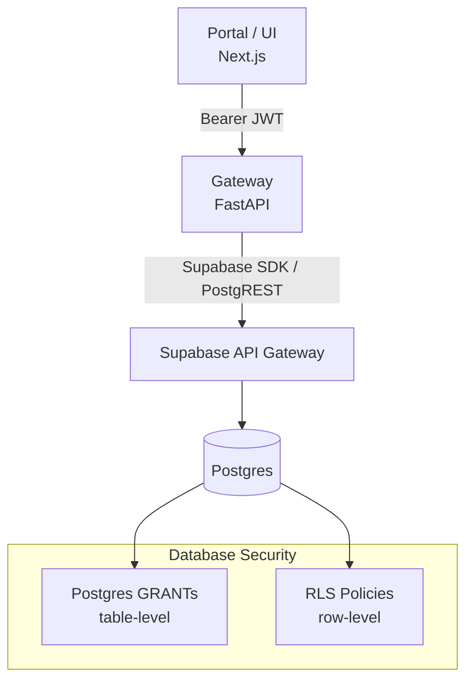
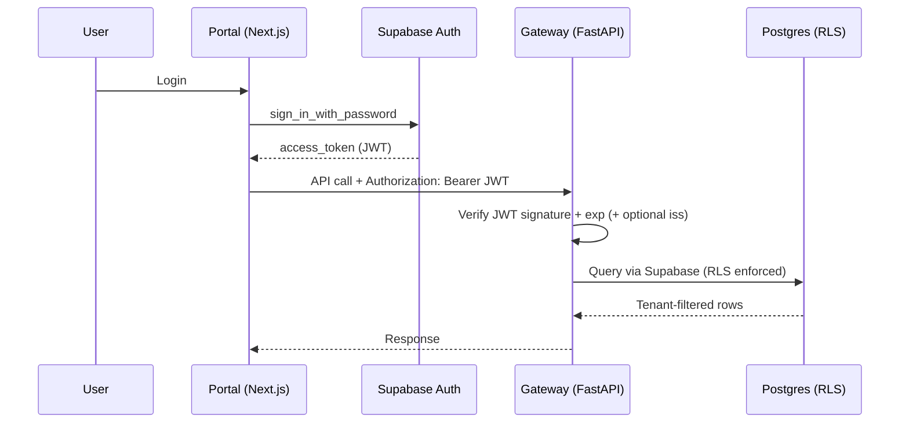
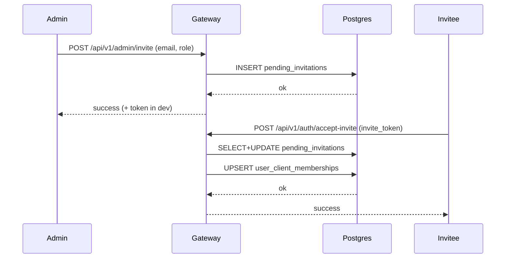
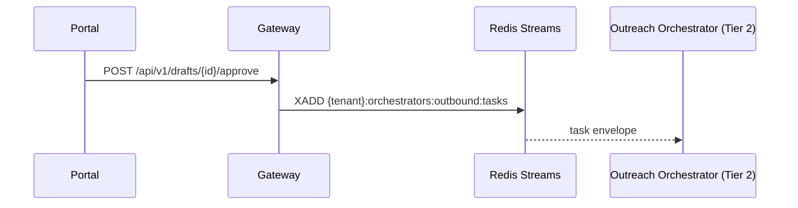

# Security Model

This document describes the security architecture of the Agentic System (Portal + Gateway + Supabase).

## Overview

Security is implemented in layers:



Key properties:

- Authentication is via Supabase-issued JWTs.
- Authorization is enforced in two places:
  - Gateway RBAC (admin-only endpoints)
  - Postgres RLS (tenant isolation)
- Rate limiting is enforced at the Gateway.
- Audit logging captures security-relevant actions.

---

## Authentication & Request Flow



Gateway JWT validation details:

- Signature verification uses `SUPABASE_JWT_SECRET` (HS256).
- Expiration is always enforced.
- Issuer verification can be enabled in production via `SUPABASE_JWT_ISSUER`.

---

## Tenant Isolation (RLS)

Tenant isolation is enforced at the database via RLS.

### Membership model

Users are associated with tenants (clients) via a membership table:

```sql
CREATE TABLE public.user_client_memberships (
    user_id uuid references auth.users(id),
    client_id uuid references public.clients(id),
    role text check (role in ('admin','member','viewer')),
    primary key (user_id, client_id)
);
```

### Current tenant resolution

RLS policies should resolve the active tenant through a single helper function (so policies stay consistent):

- `public.get_current_client_id()`

Conceptually:

```mermaid
flowchart LR
    JWT[JWT Claims] -->|optional| CID[get_current_client_id()]
    SESS[DB session var<br/>app.current_client] --> CID
    MEM[user_client_memberships] --> CID
    CID --> POL[RLS policy condition]
```

### Policy patterns

Direct `client_id` tables:

```sql
CREATE POLICY tenant_isolation_leads ON public.leads
FOR ALL
USING (client_id = public.get_current_client_id());
```

Nested tables (example: `messages` → `conversations.client_id`):

```sql
CREATE OR REPLACE FUNCTION public.get_client_id_from_conversation(conv_id uuid)
returns uuid language sql stable security definer as $$
    select c.client_id from public.conversations c where c.id = conv_id limit 1;
$$;

CREATE POLICY tenant_isolation_messages ON public.messages
FOR ALL
USING (public.get_client_id_from_conversation(conversation_id) = public.get_current_client_id());
```

For a practical “who reads/writes what” view (Portal vs Gateway vs Tier 1/2/3 components), see:

- [Database Schema → How These Tables Are Used At Runtime](../reference/database/schema.md#how-these-tables-are-used-at-runtime)

---

## Rate Limiting

Gateway rate limiting is applied per-IP, with stricter limits on auth endpoints:

| Endpoint                 | Limit | Window |
| ------------------------ | ----: | -----: |
| `/api/v1/auth/login`     |     5 |    60s |
| `/api/v1/auth/signup`    |     3 |    60s |
| `/api/v1/auth/dev-login` |    10 |    60s |
| Other endpoints          |   100 |    60s |

Responses include:

- `X-RateLimit-Limit`
- `X-RateLimit-Remaining`
- `X-RateLimit-Reset`

---

## Admin/User Management

Admin endpoints are exposed from the Gateway and require `role=admin`.



---

## Gateway Routers and How They Connect to Outbound

The Gateway exposes tenant-scoped HTTP endpoints for the Portal and acts as a bridge into the agent system.

### What the routers do (today)

- **Auth/Admin routers** handle tenant onboarding and permissions:
  - `POST /api/v1/admin/invite` inserts into `pending_invitations`.
  - `POST /api/v1/auth/accept-invite` calls Postgres RPC `accept_invitation(...)`, which upserts `user_client_memberships` and marks the invite accepted.
  - These flows are _security primitives_ (who can access tenant data).

- **Resource routers** (leads/conversations/mailboxes/drafts) are partially stubbed:
  - Several endpoints currently return **mock data** and include TODOs to query Supabase.
  - The `drafts` router already supports outbound actions by enqueuing work to the Outreach orchestrator stream.

### How it connects to outbound (current wiring)

When a user approves a draft in the Portal, the Gateway enqueues an outbound task to Redis Streams:



Notes:

- This is _command ingress_: “approve/rewrite” becomes an orchestrator task.
- Stream naming stays vertical: `{tenant}:orchestrators:outbound:tasks`.
- The DB tables `mailboxes` and `drafts` exist (and are RLS-protected), but not all Gateway endpoints are consistently persisting them yet (some still serve mock responses).

### Intended DB-backed outbound flow (next step)

Once the routers are wired to Supabase for real data:

1. Portal lists `mailboxes` and `drafts` via Gateway.
2. Approve updates `drafts.status=approved` (and optional edited body).
3. A sender path (service/worker/agent) sends using the selected `mailbox`.
4. On success, record an outbound `messages` row (conversation timeline) and set `drafts.status=sent`.

This is the core distinction:

- `drafts` = planned/approved outbound content lifecycle.
- `messages` = canonical record of what actually happened in the thread.

## Audit Logging

Security-relevant events are written to `public.audit_log`.

Typical event types:

- `user.invited`
- `invitation.accepted`
- `member.role_updated`
- `member.removed`
- `client.created`

---

## Dev-only features

`/api/v1/auth/dev-login` is gated so it is not usable in production.

---

## Implementation references

Gateway:

- `api/gateway/dependencies/auth.py` (JWT validation)
- `api/gateway/middleware/rate_limit.py` (rate limiting)
- `api/gateway/routers/admin.py` (admin endpoints)
- `api/gateway/routers/auth.py` (auth + accept-invite)

Database migrations:

- `supabase/migrations/20260128120000_invitations_audit.sql`
- `supabase/migrations/20260128130000_complete_tenant_isolation.sql`

---

## Secrets Management

### Secret Types

| Secret                | Storage                   | Access          |
| --------------------- | ------------------------- | --------------- |
| `SUPABASE_URL`        | Env var / Secrets Manager | All agents      |
| `SUPABASE_ANON_KEY`   | Env var / Secrets Manager | All agents      |
| `SUPABASE_JWT_SECRET` | Env var / Secrets Manager | JWT signing     |
| `OPENAI_API_KEY`      | Env var / Secrets Manager | Copywriter only |
| `GMAIL_REFRESH_TOKEN` | Env var / Secrets Manager | Email service   |

### Best Practices

- Never log secrets
- Rotate secrets regularly
- Use different secrets per environment
- Store in secrets manager for production

---

## Input Validation

### Task Payload Validation

```python
from pydantic import BaseModel, EmailStr

class LeadCreate(BaseModel):
    name: str
    email: EmailStr
    client_id: UUID

    class Config:
        extra = "forbid"  # Reject unknown fields

# In agent
def process_task(self, task: dict):
    payload = LeadCreate(**task["payload"])  # Validates
    # Continue with validated data
```

### SQL Injection Prevention

```python
# ❌ NEVER
query = f"SELECT * FROM leads WHERE email = '{email}'"

# ✅ ALWAYS use parameterized queries
adapter.query("leads", {"email": email})
```

---

## Network Security

### Production Setup

```
┌─────────────────────────────────────────────────────────────┐
│                         VPC                                 │
│                                                             │
│  ┌──────────┐    ┌──────────┐    ┌──────────────────────┐  │
│  │ Internet │───▶│   ALB    │───▶│   Private Subnet     │  │
│  │          │    │ (HTTPS)  │    │                      │  │
│  └──────────┘    └──────────┘    │  ┌────────────────┐  │  │
│                                   │  │    Agents      │  │  │
│                                   │  └────────────────┘  │  │
│                                   │                      │  │
│                                   │  ┌────────────────┐  │  │
│                                   │  │     Redis      │  │  │
│                                   │  └────────────────┘  │  │
│                                   │                      │  │
│                                   └──────────────────────┘  │
│                                                             │
└─────────────────────────────────────────────────────────────┘
                        │
                        ▼ (TLS)
              ┌──────────────────┐
              │    Supabase      │
              │  (Managed Cloud) │
              └──────────────────┘
```

### TLS Configuration

```python
# Redis with TLS
redis_client = redis.from_url(
    "rediss://redis-host:6379/0",  # Note: rediss:// for TLS
    ssl_cert_reqs="required"
)
```

---

## Audit Logging (Operational)

### What's Logged

- All Manager decisions
- All database writes
- All external API calls
- Authentication failures

### Log Format

```json
{
  "timestamp": "2025-01-15T10:00:00Z",
  "level": "INFO",
  "component": "persistence_agent",
  "tenant_id": "agentic-dev",
  "action": "create",
  "table": "leads",
  "record_id": "uuid",
  "user_role": "agent_writer"
}
```

### Sensitive Data

```python
# ❌ NEVER log sensitive data
logger.info(f"API key: {api_key}")

# ✅ Log references only
logger.info(f"Using API key ending in: ...{api_key[-4:]}")
```

---

## Threat Model

### Threats & Mitigations

| Threat              | Mitigation                              |
| ------------------- | --------------------------------------- |
| SQL Injection       | Parameterized queries, input validation |
| Cross-tenant access | RLS policies with tenant_id             |
| Credential theft    | Secrets manager, rotation               |
| Man-in-the-middle   | TLS everywhere                          |
| Unauthorized access | JWT auth, role-based access             |
| Data exfiltration   | Audit logging, least privilege          |

---

## Security Checklist

### Development

- [ ] Secrets in `.env` (not committed)
- [ ] Input validation on all endpoints
- [ ] No secrets in logs
- [ ] Dependencies scanned for vulnerabilities

### Staging/Production

- [ ] Secrets in Secrets Manager
- [ ] TLS enabled for all connections
- [ ] RLS policies verified
- [ ] Audit logging enabled
- [ ] Network isolation configured
- [ ] Regular secret rotation

## Related

- [Row-Level Security](../reference/database/rls.md)
- [Secrets Management](../guides/deploy/secrets.md)
- [Multi-Tenancy Concept](../concepts/multi-tenancy.md)
