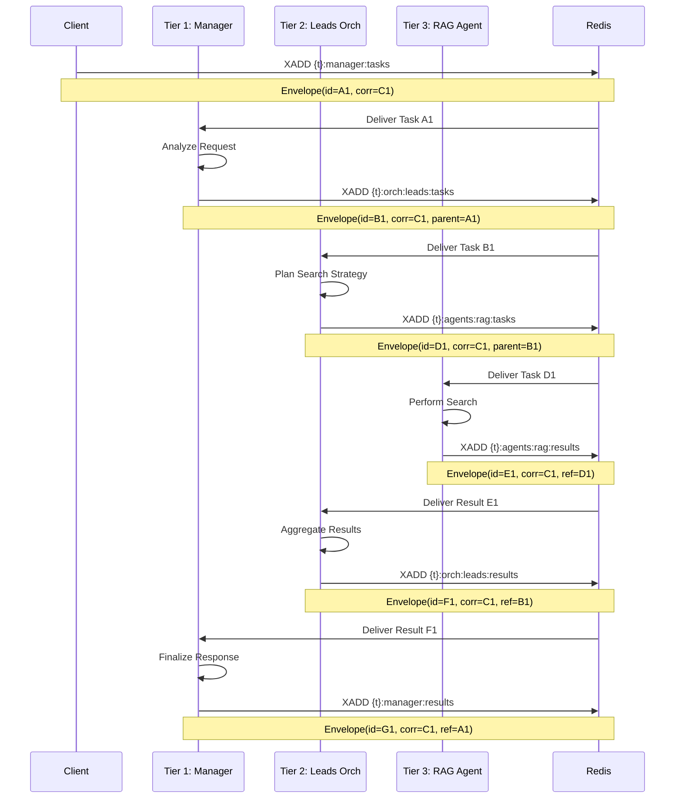
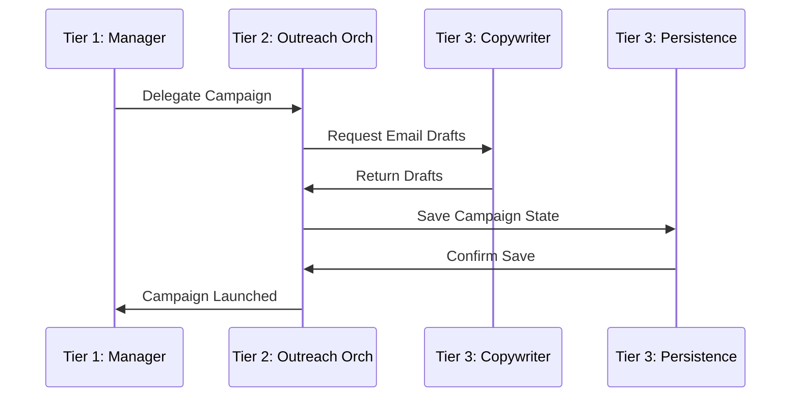

# Agent Communication Flows & Envelope Lifecycle
**Date:** November 20, 2025
**Status:** Flow Documentation

## 1. Overview
This document details how messages flow through the three-tier architecture. The system relies on **asynchronous delegation** via Redis Streams.

**Key Concept: The Correlation ID**
Every request that enters the system is assigned a `correlation_id`. This ID **must** be preserved and passed down to every sub-task. This allows us to trace a single user request across dozens of micro-operations.

---

## 2. Flow 1: Lead Discovery (Manager → Leads → RAG)

### 2.1 Sequence Diagram


### 2.2 Envelope Transformation
At each step, the payload changes, but the metadata maintains the lineage.

**Step 1: Manager Task**
```json
{
  "metadata": { "message_id": "A1", "correlation_id": "C1", "source": "API" },
  "payload": { "goal": "Find AI startups in SF" }
}
```

**Step 2: Leads Task (Delegation)**
```json
{
  "metadata": { "message_id": "B1", "correlation_id": "C1", "source": "Manager", "parent_id": "A1" },
  "payload": { "criteria": { "industry": "AI", "location": "SF" } }
}
```

**Step 3: RAG Task (Sub-delegation)**
```json
{
  "metadata": { "message_id": "D1", "correlation_id": "C1", "source": "LeadsOrch", "parent_id": "B1" },
  "payload": { "query": "AI startups San Francisco funding > 1M" }
}
```

---

## 3. Flow 2: Outreach Campaign (Manager → Outreach → Copywriter)

### 3.1 Sequence Diagram


---

## 4. Error Handling Flow

If an agent fails, the error propagates up the stack, but can be handled at any tier.

**Scenario: RAG Fails**
1. **RAG Agent** encounters exception.
2. **RAG Agent** publishes to `{t}:agents:rag:results` with `status: ERROR`.
   ```json
   {
     "status": "ERROR",
     "error": { "code": "TIMEOUT", "message": "Search API unavailable" }
   }
   ```
3. **Leads Orchestrator** receives Error Result.
4. **Leads Orchestrator** decides:
   - **Retry:** Send task back to RAG (maybe different query).
   - **Fail:** Propagate error to Manager.
   - **Fallback:** Try a different agent (e.g., internal DB search).

This "Bubble Up" error handling allows the Orchestrator to be the "Brain" that recovers from Tier 3 failures, keeping the Manager shielded from low-level issues.
