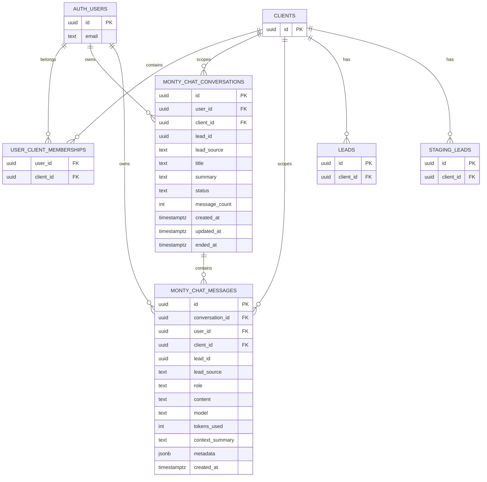

# Monty Copilot Backend (How It Connects)

This page explains how Monty Copilot data is modeled and how it connects across **users**, **clients (tenants)**, and **prospects** (leads), including how the portal API persists conversations and messages.

## Mental model

- A **user** (team member) chats with Monty **about a single prospect**.
- That chat happens inside a **conversation session** (`monty_chat_conversations`).
- Each session contains **many messages** (`monty_chat_messages`).
- Everything is scoped by `client_id` to enforce multi-tenancy.

## Core relationships



### Prospect keying (`lead_id` + `lead_source`)

Monty Copilot supports both qualified and pre-qualified prospects:

- `lead_source = 'leads'` means `lead_id` refers to `public.leads.id`
- `lead_source = 'staging_leads'` means `lead_id` refers to `public.staging_leads.id`

This is implemented as a **soft FK** (no direct FK constraint) and enforced in application logic and via consistent scoping.

## Tables (what they do)

### `monty_chat_conversations`

A conversation session:

- Owned by `user_id`
- Tenant-scoped via `client_id`
- Tied to a single prospect via `lead_id` + `lead_source`
- Has `status` (`open`/`closed`), timestamps, and cached `message_count`
- Optional linkage to outreach/inbound conversations via:
  - `related_conversation_id`
  - `related_conversation_source` (`conversations` or `staging_conversations`)

### `monty_chat_messages`

Individual messages in a session:

- Has a required FK `conversation_id` → `monty_chat_conversations.id`
- Duplicates scope columns (`user_id`, `client_id`, `lead_id`, `lead_source`) as guardrails and for fast scoped queries
- Includes optional AI metadata (`model`, `tokens_used`, `context_summary`, `metadata`)

### Legacy: `monty_chats`

`monty_chats` is the legacy message table that existed before `monty_chat_messages` was introduced. A migration backfills legacy rows into `monty_chat_messages` and also backfills a closed “Previous chat” conversation for older rows that had no session.

## Consistency + safety rules (DB-level)

### Scope match guard

A `BEFORE INSERT` trigger on `monty_chat_messages` enforces that a message’s scope matches the parent conversation scope:

- `(user_id, client_id, lead_id, lead_source)` must match the referenced conversation

This prevents cross-user / cross-tenant leakage even if the API layer has a bug.

### Conversation stats

Triggers on `monty_chat_messages` keep the parent conversation updated:

- Recompute `message_count`
- Bump `updated_at`

### Auto-title

A trigger on `monty_chat_messages` sets `monty_chat_conversations.title` from the **first user message** if no title exists.

### Single open conversation

A partial unique index enforces:

- at most one `status = 'open'` conversation per `(user_id, client_id, lead_id, lead_source)`

The portal API also proactively closes any existing open conversation before opening a new one.

## Security model (RLS)

### Primary principle

Authenticated users can only access Monty data that:

- belongs to them (`auth.uid() = user_id`)
- AND is in a client they are a member of (`user_client_memberships` contains `(auth.uid(), client_id)`)

This applies to both `monty_chat_conversations` and `monty_chat_messages` after the RLS hardening migration.

### Service role usage

The portal sometimes uses a service-role Supabase client for **read-only lead context lookups**. Even then, the code filters by `client_id` to avoid cross-tenant probing.

For Monty writes (creating conversations and inserting messages), the portal uses the authenticated client so RLS continues to enforce user ownership.

## Portal API flow (persistence)

### Start/list conversations

Endpoint: `apps/portal-customer/src/app/api/monty/chat/conversations/route.ts`

- `GET` lists closed conversations for a given prospect (limited)
- `POST` closes any open conversation for that scope, prunes older closed sessions, and creates a new `open` conversation

### Chat + message persistence

Endpoint: `apps/portal-customer/src/app/api/monty/chat/route.ts`

On `POST` (send message):

1. Authenticate user
2. Resolve `client_id` via `user_client_memberships`
3. Verify the target lead belongs to that client
4. Ensure there is an `open` conversation (`monty_chat_conversations`)
5. Insert two rows into `monty_chat_messages`:
   - user message (`role = 'user'`)
   - assistant response (`role = 'assistant'`)

On `GET` (history):

- Fetches messages from `monty_chat_messages` for a given `conversation_id`, scoped by user + client + prospect

## Useful queries

### Conversations for a prospect

```sql
SELECT id, status, title, message_count, created_at, updated_at
FROM public.monty_chat_conversations
WHERE lead_id = '...'
  AND lead_source = 'leads'
ORDER BY updated_at DESC;
```

### Messages for a conversation

```sql
SELECT role, content, model, created_at
FROM public.monty_chat_messages
WHERE conversation_id = '...'
ORDER BY created_at ASC;
```

## Migrations (rollout)

Monty Copilot’s schema is introduced via Supabase migrations in `supabase/migrations/`.

Key migrations for the messages-table architecture:

- `20260206120000_monty_chat_messages_table.sql` — creates `monty_chat_messages`, triggers, and backfills legacy data
- `20260206130000_monty_single_open_conversation.sql` — enforces one open conversation per scope
- `20260206131000_monty_copilot_rls_hardening.sql` — tightens RLS to require both ownership and client membership

If the portal is pointed at a remote Supabase project, these migrations must be pushed to that project for `monty_chat_messages` to exist.
