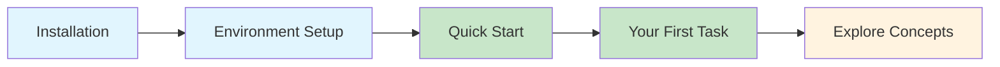

# Getting Started

Welcome to the Agentic System! This section will guide you from zero to running your first AI agent workflow.

## Quick Navigation

- :material-download:{ .lg .middle } **Installation**

  ***

  Clone the repository, set up Python, and install dependencies.

  [:octicons-arrow-right-24: Install now](installation.md)

- :material-rocket-launch:{ .lg .middle } **Quick Start**

  ***

  Run your first agent workflow in under 5 minutes.

  [:octicons-arrow-right-24: Get started](quickstart.md)

- :material-key:{ .lg .middle } **Environment Setup**

  ***

  Configure all required environment variables and secrets.

  [:octicons-arrow-right-24: Configure](environment.md)

- :material-play-circle:{ .lg .middle } **Your First Task**

  ***

  Send a task through the system and understand the flow.

  [:octicons-arrow-right-24: Try it](first-task.md)

## Prerequisites

Before you begin, ensure you have:

| Requirement      | Version | Notes                                  |
| ---------------- | ------- | -------------------------------------- |
| Python           | 3.11+   | 3.13 recommended                       |
| Redis            | 7.0+    | For stream messaging                   |
| Docker           | 24.0+   | Optional, for containerized deployment |
| Supabase Account | —       | Free tier works for development        |
| OpenAI API Key   | —       | Or Anthropic API key                   |

## Recommended Path

1. **[Installation](installation.md)** — Get the code and dependencies
2. **[Environment Setup](environment.md)** — Configure secrets and connections
3. **[Quick Start](quickstart.md)** — Start Redis and run consumers
4. **[Your First Task](first-task.md)** — Send a task and trace the flow
5. **[Concepts](../concepts/index.md)** — Understand the architecture

## Time Estimate

| Step              | Time        |
| ----------------- | ----------- |
| Installation      | 5-10 min    |
| Environment Setup | 10-15 min   |
| Quick Start       | 5 min       |
| First Task        | 10 min      |
| **Total**         | **~40 min** |

## Need Help?

- Check [Troubleshooting](../guides/ops/troubleshooting.md) for common issues
- Review [Concepts](../concepts/index.md) for architectural understanding
- See [Incident Playbooks](../guides/ops/incident-response.md) for production issues
