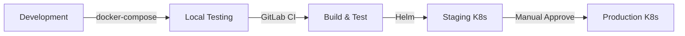

# Deployment Guides

Guides for deploying the Agentic System to various environments.

## Deployment Options

<div class="grid cards" markdown>

- :material-docker:{ .lg .middle } **Docker Compose**

  ***

  Local development and simple production deployments.

  [:octicons-arrow-right-24: Docker Guide](docker.md)

- :material-kubernetes:{ .lg .middle } **Kubernetes**

  ***

  Scalable production deployments with K8s.

  [:octicons-arrow-right-24: Kubernetes Guide](kubernetes.md)

- :simple-helm:{ .lg .middle } **Helm Chart**

  ***

  One-command deployment with parameterized values.

  [:octicons-arrow-right-24: Helm Guide](helm.md)

- :material-pipe:{ .lg .middle } **CI/CD**

  ***

  Automated testing and deployment pipelines (GitLab).

  [:octicons-arrow-right-24: CI/CD Guide](ci-cd.md)

- :material-key:{ .lg .middle } **Secrets**

  ***

  Secure secrets management across environments.

  [:octicons-arrow-right-24: Secrets Guide](secrets.md)

</div>

## Recommended Path



!!! tip "Production Recommendation"
Use the **Helm chart** (`charts/agentic-system/`) for production deployments. It bundles all K8s resources with sensible defaults and easy customization.

## Deployment Architecture

```
┌─────────────────────────────────────────────────────────────┐
│                    Production Setup                          │
│                                                              │
│  ┌──────────────┐    ┌──────────────┐    ┌──────────────┐  │
│  │   GitLab     │───▶│   CI/CD      │───▶│  Container   │  │
│  │   (source)   │    │  (lint+test) │    │  Registry    │  │
│  └──────────────┘    └──────────────┘    └──────────────┘  │
│                                                   │          │
│                                                   ▼          │
│                              ┌────────────────────────────┐ │
│                              │       Kubernetes           │ │
│                              │       (via Helm)           │ │
│                              │  ┌────────┐ ┌────────┐    │ │
│                              │  │ Agent  │ │ Agent  │    │ │
│                              │  │  Pod   │ │  Pod   │    │ │
│                              │  └────────┘ └────────┘    │ │
│                              │                            │ │
│                              │  ┌────────────────────┐   │ │
│                              │  │   Redis Cloud (TLS) │   │ │
│                              │  └────────────────────┘   │ │
│                              │                            │ │
│                              └────────────────────────────┘ │
│                                          │                  │
│                                          ▼                  │
│                              ┌────────────────────┐        │
│                              │     Supabase       │        │
│                              │   (PostgreSQL)     │        │
│                              └────────────────────┘        │
│                                                              │
└─────────────────────────────────────────────────────────────┘
```

## Environment Comparison

| Aspect           | Docker Compose  | Kubernetes (Helm)  |
| ---------------- | --------------- | ------------------ |
| **Complexity**   | Low             | Medium (with Helm) |
| **Scalability**  | Limited         | Excellent          |
| **Best For**     | Dev, small prod | Large prod, SaaS   |
| **Cost**         | Low             | Higher             |
| **Ops Overhead** | Minimal         | Moderate           |

## Quick Start

### Local Development

```powershell
# Start all services
docker-compose up -d
```

### Production (Helm)

```bash
# Deploy with Helm
helm upgrade --install agentic charts/agentic-system \
  --namespace agentic-system \
  --create-namespace
```

## Prerequisites

- Docker 24.0+
- Docker Compose 2.0+
- Kubernetes 1.25+ (for K8s deployment)
- kubectl configured
- Access to container registry

## Next Steps

1. [Set up Docker locally](docker.md)
2. [Configure secrets](secrets.md)
3. [Set up CI/CD](ci-cd.md)
4. [Deploy to Kubernetes](kubernetes.md)
