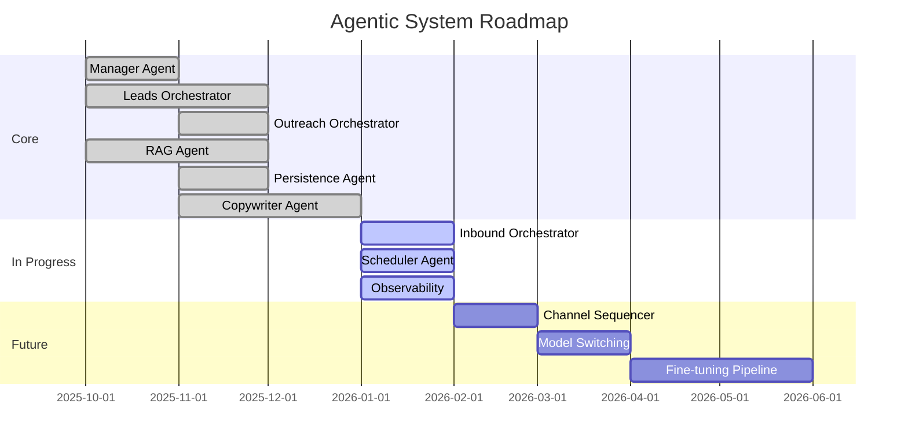

# Roadmap

The development roadmap for the Agentic System, including current priorities, in-progress work, and future plans.

## Current Status

**Version:** 0.1.0 (Pre-release)  
**Last Updated:** January 2026

The system is in active development with core infrastructure complete and primary workflows functional.

## Roadmap Overview

- :material-progress-clock:{ .lg .middle } **In Progress**

  ***

  Components currently under active development.

  [:octicons-arrow-right-24: View In Progress](in-progress.md)

- :material-crystal-ball:{ .lg .middle } **Future Plans**

  ***

  Planned features and enhancements for upcoming releases.

  [:octicons-arrow-right-24: View Future Plans](future.md)

- :material-history:{ .lg .middle } **Changelog**

  ***

  Release history and version notes.

  [:octicons-arrow-right-24: View Changelog](changelog.md)

## High-Level Timeline

## Priority Matrix

### P0 — Critical (Current Sprint)

| Item                             | Status         | Owner |
| -------------------------------- | -------------- | ----- |
| Complete Inbound Orchestrator    | 🚧 In Progress | —     |
| Finish observability integration | 🚧 In Progress | —     |
| Production deployment guide      | 🚧 In Progress | —     |

### P1 — High (Next Sprint)

| Item                           | Status     |
| ------------------------------ | ---------- |
| Scheduler Agent implementation | 📋 Planned |
| Channel Sequencer Agent        | 📋 Planned |
| Rate limiting & quotas         | 📋 Planned |

### P2 — Medium (Backlog)

| Item                                 | Status     |
| ------------------------------------ | ---------- |
| Model switching (OpenAI ↔ Anthropic) | 📋 Planned |
| A/B testing framework                | 📋 Planned |
| Multi-tenant dashboard               | 📋 Planned |

### P3 — Low (Future)

| Item                    | Status  |
| ----------------------- | ------- |
| Fine-tuning pipeline    | 💡 Idea |
| Voice agent integration | 💡 Idea |
| Custom model training   | 💡 Idea |

## Component Completion Status

### Tier 1 — Manager

| Component         | Status      |
| ----------------- | ----------- |
| Manager Agent     | ✅ Complete |
| Policy Router     | ✅ Complete |
| Intent Classifier | ✅ Complete |
| Shortcut Registry | ✅ Complete |

### Tier 2 — Orchestrators

| Component             | Status         |
| --------------------- | -------------- |
| Leads Orchestrator    | ✅ Complete    |
| Outreach Orchestrator | ✅ Complete    |
| Inbound Orchestrator  | 🚧 In Progress |
| Audit Orchestrator    | 📋 Skeleton    |
| Control Orchestrator  | 📋 Skeleton    |

### Tier 3 — Agents

| Component         | Status         |
| ----------------- | -------------- |
| RAG Agent         | ✅ Complete    |
| Persistence Agent | ✅ Complete    |
| Copywriter Agent  | ✅ Complete    |
| Scheduler Agent   | 🚧 In Progress |
| Channel Sequencer | 📋 Skeleton    |

### Services

| Component           | Status      |
| ------------------- | ----------- |
| Redis Service       | ✅ Complete |
| Persistence Service | ✅ Complete |
| Vector DB Service   | ✅ Complete |
| Email Service       | ✅ Complete |

## Contributing

Want to contribute? Check the [In Progress](in-progress.md) page for items seeking contributors, or review the [Future Plans](future.md) for ideas to propose.
