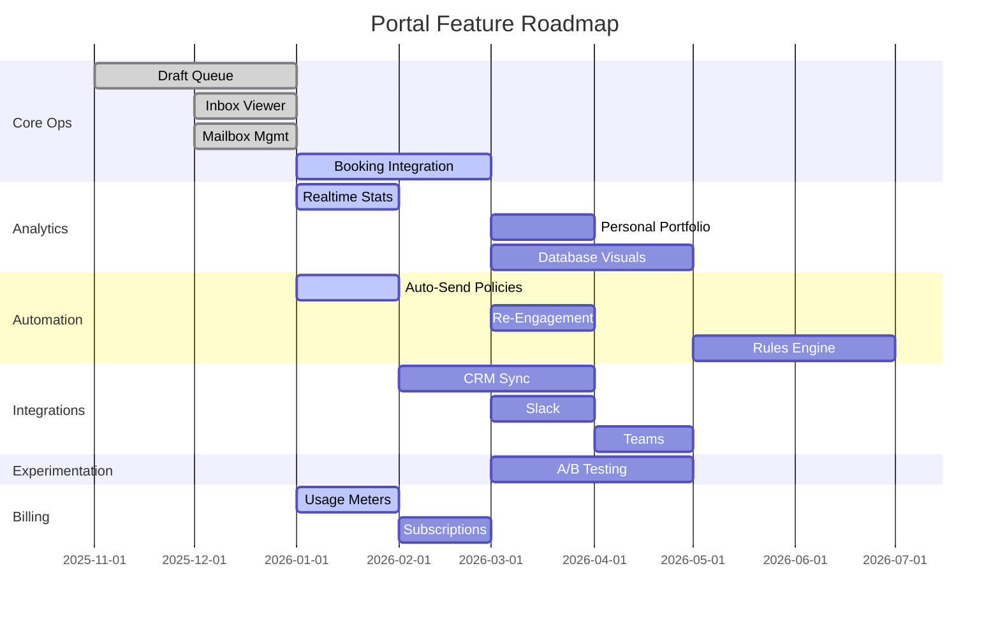

# Portal Feature Roadmap

This page outlines **planned and in-progress features** for the customer portal and related websites, organized by category and priority.

---

## Feature Categories

| Category           | Description                                    |
| ------------------ | ---------------------------------------------- |
| 🎯 Core Ops        | Essential workflows (drafts, approvals, inbox) |
| 📊 Analytics       | Metrics, dashboards, reporting                 |
| 🤖 Automation      | Auto-send, re-engagement, sequencing           |
| 🔗 Integrations    | CRM, Slack, Teams, calendar                    |
| 👤 Personalization | User profiles, portfolios, preferences         |
| 🧪 Experimentation | A/B testing, variant tracking                  |
| 💾 Data            | Database visuals, export, import               |
| 💳 Billing         | Plans, usage, invoices                         |

---

## 🎯 Core Ops Features

### Draft Approval Queue

**Status:** ✅ Shipped (MVP)  
**Priority:** P0

The central workflow: view inbound-triggered drafts, edit, approve, or reject.

- Draft card with context, subject, body
- Edit-in-place composer
- Approve & Send / Reject actions
- Status tracking (drafted → approved → sent/failed)
- Trace fields visible (`correlation_id`, `query_trace`)

---

### Inbox & Conversation Viewer

**Status:** ✅ Shipped (MVP)  
**Priority:** P0

Browse conversations per connected mailbox, view full thread history.

- Per-mailbox inbox list
- Thread view with all messages
- Retrieved lead/company context panel
- Link to related draft (if exists)

---

### Multi-Mailbox Management

**Status:** ✅ Shipped (MVP)  
**Priority:** P0

Connect and manage multiple mailboxes per tenant.

- OAuth connect flow (Gmail, Outlook)
- Connection status & health
- Last sync timestamp
- Disconnect / reconnect actions

---

### Booking Integration

**Status:** 🚧 In Progress  
**Priority:** P1

Let leads book meetings directly from outreach emails.

**Planned:**

- Calendar integration (Google Calendar, Outlook, Calendly)
- Booking link insertion in drafts
- Availability sync
- Meeting confirmation tracking
- No-show / reschedule handling

---

## 📊 Analytics Features

### Realtime Statistics Dashboard

**Status:** 🚧 In Progress  
**Priority:** P1

Live metrics for the logged-in tenant, updated in real-time.

**Planned:**

- Emails sent / received (today, week, month)
- Drafts created / approved / rejected
- Reply rate, open rate (when trackable)
- Lead qualification funnel
- Live activity feed (WebSocket-powered)

---

### Personal Portfolio / Profile

**Status:** 📋 Planned  
**Priority:** P2

Per-user profile with personalized stats and preferences.

**Planned:**

- User avatar, bio, contact info
- Personal KPIs (emails handled, approval rate)
- Notification preferences
- Activity history
- Team comparison (if permitted by admin)

---

### Database Visuals

**Status:** 📋 Planned  
**Priority:** P2

Visual exploration of leads, conversations, and campaigns.

**Planned:**

- Lead table with search, filter, sort
- Conversation timeline visualization
- Campaign performance charts (bar, line, funnel)
- Export to CSV / Excel
- Saved views / filters

---

## 🤖 Automation Features

### Auto-Send Policies

**Status:** 🚧 In Progress  
**Priority:** P1

Controlled auto-send with guardrails.

**Planned:**

- Opt-in toggle (off by default)
- Per-mailbox / per-campaign granularity
- Throttle limits (max sends/hour, max sends/day)
- Hard-stop rules (blocked domains, keywords)
- Policy audit log

---

### Re-Engagement Sequences

**Status:** 📋 Planned  
**Priority:** P2

Automated follow-ups for non-responsive leads.

**Planned:**

- Sequence builder (delay, template, condition)
- Trigger rules (no reply in X days, opened but no reply)
- Pause / resume sequences
- Sequence performance metrics
- Integration with A/B testing

---

### Automation Rules Engine

**Status:** 📋 Planned  
**Priority:** P3

User-defined rules for actions based on events.

**Planned:**

- Rule builder UI (if/then logic)
- Event triggers (new lead, reply received, meeting booked)
- Action types (send email, update lead, notify Slack)
- Rule testing / dry-run mode
- Audit log for rule executions

---

## 🔗 Integration Features

### CRM Integration

**Status:** 📋 Planned  
**Priority:** P1

Sync leads, conversations, and activities with external CRMs.

**Planned:**

- Salesforce, HubSpot, Pipedrive connectors
- Bi-directional sync (push + pull)
- Field mapping UI
- Sync status & error visibility
- Activity logging (emails, meetings)

---

### Slack Integration

**Status:** 📋 Planned  
**Priority:** P2

Notifications and quick actions via Slack.

**Planned:**

- Slack app install flow
- Channel notifications (new draft, approval needed, send success/failure)
- Quick approve/reject from Slack
- Daily digest messages
- Slash commands for status checks

---

### Microsoft Teams Integration

**Status:** 📋 Planned  
**Priority:** P2

Same as Slack, for Teams-first organizations.

**Planned:**

- Teams app install flow
- Adaptive cards for notifications
- Quick actions from Teams
- Channel-based alerts
- Teams bot for status queries

---

### Calendar Sync

**Status:** 📋 Planned  
**Priority:** P2

Keep availability in sync for booking features.

**Planned:**

- Google Calendar, Outlook Calendar connectors
- Read availability for booking links
- Write confirmed meetings to calendar
- Busy/free status display
- Timezone handling

---

## 🧪 Experimentation Features

### A/B Testing Framework

**Status:** 📋 Planned  
**Priority:** P2

Test different templates, subject lines, and strategies.

**Planned:**

- Experiment builder (variants, traffic split)
- Automatic variant assignment per lead
- Metric tracking (open rate, reply rate, meeting rate)
- Statistical significance calculation
- Winner auto-promotion
- Experiment archive & history

---

### Template Variants

**Status:** 📋 Planned  
**Priority:** P2

Multiple versions of email templates for testing.

**Planned:**

- Template versioning
- Variant tagging (A, B, C...)
- Performance comparison view
- Clone & modify workflow
- Integration with A/B testing framework

---

## 💾 Data Features

### Lead Database Browser

**Status:** 🚧 In Progress  
**Priority:** P1

Browse, search, and manage leads.

**Planned:**

- Table view with columns: name, company, status, last contact, source
- Search (name, email, company)
- Filters (status, source, date range)
- Bulk actions (archive, tag, assign)
- Export to CSV

---

### Import / Export

**Status:** 📋 Planned  
**Priority:** P2

Bring leads in, take data out.

**Planned:**

- CSV upload with column mapping
- Duplicate detection
- Import validation & error report
- Export leads, conversations, metrics
- Scheduled exports (daily CSV email)

---

### Data Visualization

**Status:** 📋 Planned  
**Priority:** P3

Charts and graphs for understanding data trends.

**Planned:**

- Funnel charts (lead → qualified → meeting → closed)
- Time series (emails/day, replies/week)
- Heatmaps (best send times)
- Cohort analysis
- Embeddable charts for reports

---

## 💳 Billing Features

### Usage Meters

**Status:** 🚧 In Progress  
**Priority:** P1

Show current usage against plan limits.

**Planned:**

- Emails sent this period
- Mailboxes connected
- Team members (seats)
- Usage bar / percentage
- Warning at 80%, block at 100%

---

### Plan & Subscription Management

**Status:** 📋 Planned  
**Priority:** P2

Self-service plan changes.

**Planned:**

- Current plan display
- Plan comparison / upgrade path
- Stripe Checkout integration
- Invoice history
- Cancel / downgrade flow

---

## Roadmap Timeline

---

## See Also

- [Design Philosophy](design-philosophy.md)
- [Implementation Details](implementations.md)
- [Core Roadmap](../roadmap/index.md)
